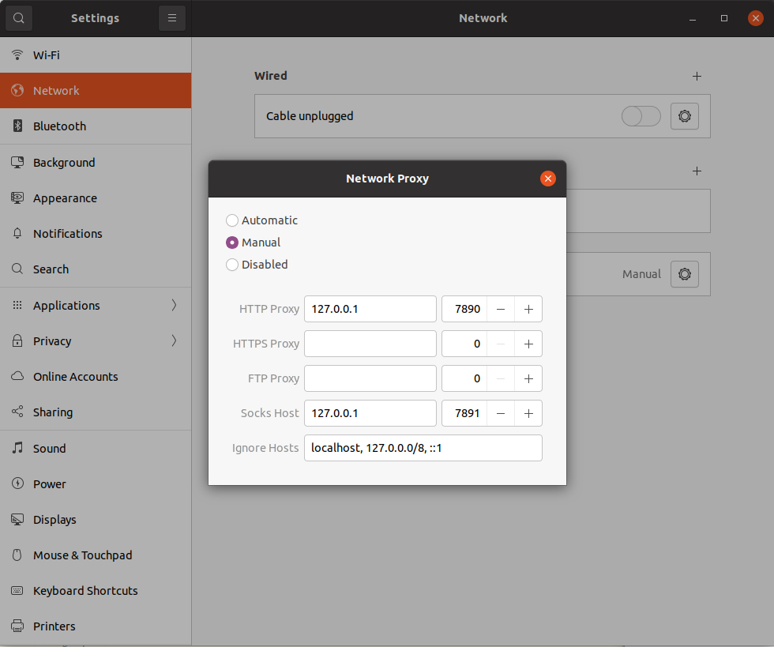

## 安装和配置Clash

1. 安装

   ```bash
   cd ~
   wget https://github.com/Dreamacro/clash/releases/download/v1.5.0/clash-linux-amd64-v1.5.0.gz
   gzip -d clash-linux-amd64-v1.5.0.gz
   mv clash-linux-amd64-v1.5.0 /usr/local/bin/clash 
   chmod +x /usr/local/bin/clash 
   ```

2. 配置

   ```bash
   mkdir -r ~/.config/clash
   mv your/config/file.yml ~/.config/clash/config.yml
   clash
   ```

   访问<http://clash.razord.top/#/proxies>，在设置中查看HTTP代理端口和Socks5代理端口

3. 配置vpn

   Settings->Network->VPN->Network Proxy

   

## 添加Clash启动服务

1. 添加service文件

   ```bash
   sudo vim /etc/systemd/system/clash.service
   ```

   **在User处填写当前用户的名称**

   ```text
   [Unit]
   Description=clash service
   After=network.target
   
   [Service]
   Type=simple
   User=root
   ExecStart=/usr/local/bin/clash
   Restart=on-failure
   
   [Install]
   WantedBy=multi-user.target
   ```

2. 设置Clash开机启动

   ```bash
   systemctl daemon-reload
   systemctl enable clash
   ```

   其他功能

   ```bash
   service clash start # 启动
   service clash stop # 停止
   service clash restart # 重启
   service clash status # 状态
   ```

   

## 参考文献
<https://suan.eu.org/post/clash-%E6%95%99%E7%A8%8B/>

